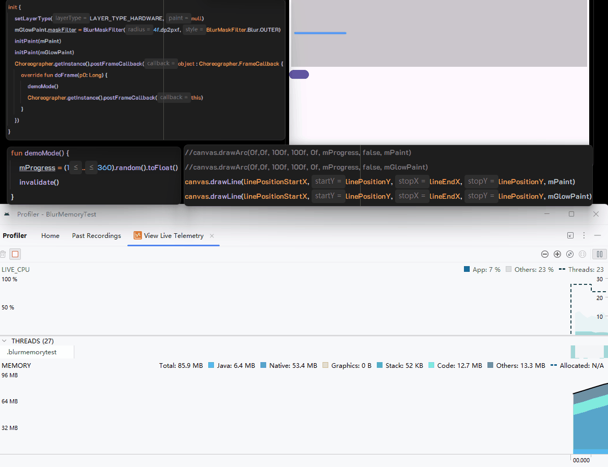

> leak by using draw line with hardware


---

> no leak by using draw arc with hardware


> gemini-2.5-pro-thinking explain
---
### **Bug Report Body:**

**Summary:**
There is a severe native memory leak in Skia's hardware-accelerated rendering pipeline when `SkCanvas::drawLine` is used with an `SkPaint` containing a `BlurMaskFilter`. This issue appears to be specific to the `drawLine` -> `drawPoints` implementation path and does not affect more complex primitives like `drawArc`, which are ultimately routed through `drawPath`. The root cause seems to be a resource management bug in handling the temporary software layers created for `drawLine`.

**Analysis and Root Cause Hypothesis:**
The memory leak stems from a fundamental difference in how `drawLine` and `drawArc` are implemented at the Skia level when a `BlurMaskFilter` forces a software fallback.

**1. The Common Entry Point: `aboutToDraw`**
Both `drawLine` (via `onDrawPoints`) and `drawArc` (via `onDrawArc`) correctly identify the need for a software layer by calling `SkCanvas::aboutToDraw`.

```cpp
// Common logic in SkCanvas for both primitives
auto layer = this->aboutToDraw(paint, &bounds); 
if (layer) {
    // If a layer is required, drawing proceeds on this new layer.
    this->topDevice()->drawSomething(...);
}
```
This confirms the initial step is consistent. The divergence that leads to the leak occurs in the subsequent drawing implementation.

**2. The Leaking Path: `SkCanvas::drawLine` -> `drawPoints`**
The implementation of `drawLine` follows a direct, primitive path that leads to the leak.

```cpp
// From SkCanvas.cpp
void SkCanvas::drawLine(SkScalar x0, SkScalar y0, SkScalar x1, SkScalar y1, const SkPaint& paint) {
    SkPoint pts[2];
    pts[0].set(x0, y0);
    pts[1].set(x1, y1);
    this->drawPoints(kLines_PointMode, 2, pts, paint); // Delegates to drawPoints
}

// In SkCanvas::onDrawPoints, after the layer is created...
this->topDevice()->drawPoints(mode, count, pts, layer->paint());
```
This path directly instructs the `SkDevice` to render points. The critical issue is that when this is used for a thin line, the `bounds` passed to `aboutToDraw` are extremely narrow (degenerate). The hardware-accelerated pipeline's resource management for these **degenerate, `drawPoints`-generated software layers appears to be defective**, leading to the layers not being deallocated and causing a continuous native memory leak.

**3. The Correct Path: `SkCanvas::drawArc` -> `drawPath`**
In contrast, `drawArc` takes a more robust, high-level path by first converting the geometric primitive into a generic `SkPath` object.

```cpp
// From SkDevice.cpp
void SkDevice::drawArc(const SkArc& arc, const SkPaint& paint) {
    SkPath path;
    // Converts the geometric arc into a full SkPath object.
    SkPathPriv::CreateDrawArcPath(&path, arc, isFillNoPathEffect);
    // Finally, it calls the highly-optimized drawPath, not a primitive draw call.
    this->drawPath(path, paint); 
}
```

**Conclusion:**
The native memory leak is not a general flaw in `BlurMaskFilter` but is specific to the **`drawLine`/`drawPoints` rendering path in Skia's hardware-accelerated backend**.

-   The **`drawPoints` path** fails to properly manage the lifecycle of the temporary, narrow software layers it generates for blurring, causing a severe leak.
-   The **`drawPath` path**, used by `drawArc`, is more abstract and robust. Its resource management for software layers is correct, and it does not leak memory.

By converting itself into an `SkPath`, `drawArc` effectively enters a different, more stable rendering pipeline, thus avoiding the bug that plagues the more primitive `drawLine` implementation. This strongly suggests the bug is localized within the resource management logic tied specifically to the `drawPoints` execution path when handling degenerate bounds under hardware acceleration.

---

**Reproduction & Demonstration:**
The issue can be reliably reproduced by creating a custom `View` with hardware acceleration enabled, and repeatedly calling `invalidate()` after drawing a line using `Canvas.drawLine()` with a `BlurMaskFilter`. A direct comparison shows that `Canvas.drawArc()` under the exact same conditions does not exhibit this memory leak.

A complete, minimal project that demonstrates this bug, including visual GIFs of the memory leak, is available on GitHub:
**https://github.com/crowforkotlin/android-canvas-drawline-blur-leak**